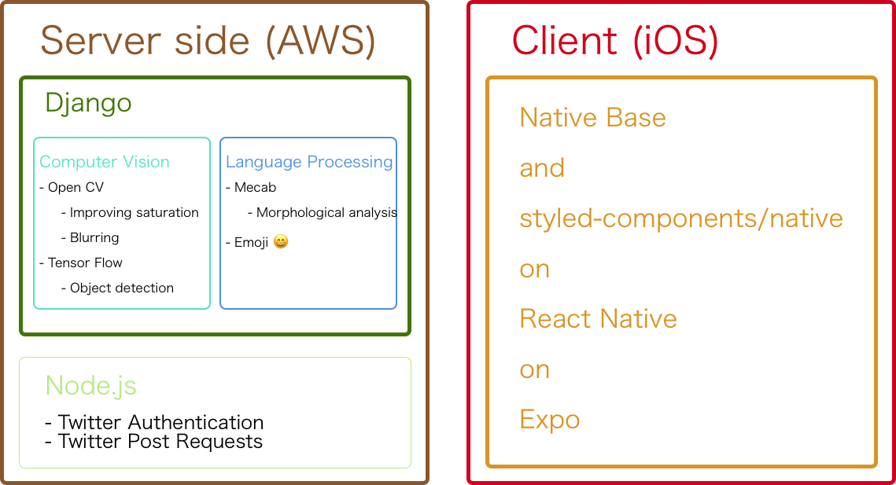

# SweetTweet

## Overview

[SPAJAM2017](http://spajam.jp/)東京予選Dにて開発。
大会テーマの「あまい」から「あまあまなリア充のツイッターを演出できるアプリ」を作成した。オリジナルのテキストと写真からキラキラJD風のツイートを自動生成する。

## Technology

### Front End

- JavaScript
	- ReactNative: A framework for building native apps using React
	- NativeBase: Essential cross-platform UI components for React Native
	- Expo: A building tool for React Native

### Server Side

- Python
	- Django: Web Application Framework
	- OpenCV: A library for computer vision
	- TensorFlow: A library for deep learning
	- Mecab: Morphological analyzer for Japanese
- Node.js
	- Express: Web Application Framework

### System

### 苦労話

- ReactNativeでネイティブっぽいことをやるとすぐ詰む
	- デバッグ環境がいろいろある & 不安定
	- 最終的には実行環境としてExpoを選定
		- 便利なComponentがいくつも実装されていて助かった
		- Expoのお陰で完成させることができた
		- 普通にデバイスでやれば簡単に実装できることもExpoだと知見が少なすぎて大変だったりしたけど…
		- Nodeじゃないと使えない / ejectしないと使えない という状況に何度遭遇したことか
- いい感じの画像処理が難しい
	- 対象物の周囲のみぼやけるようにするための手法を見つけることに苦労した
	- 最新のディープラーニングによる手法(MobileNet)を用いて物体の位置と種類を取得できるようにした
- いい感じの文章処理が難しい
	- マルチバイト文字、絵文字の扱いが難しい
	- 手間をかけた施策も効果が出ないことが多いのが難しい

### Todo

- ローカルのファイルもアップロードできるようにする
- 生成Imageを保存する
- Twitter連携を真面目にする
- カメラとカメラロールのどちらから写真を撮ってくるか選べるようにする
